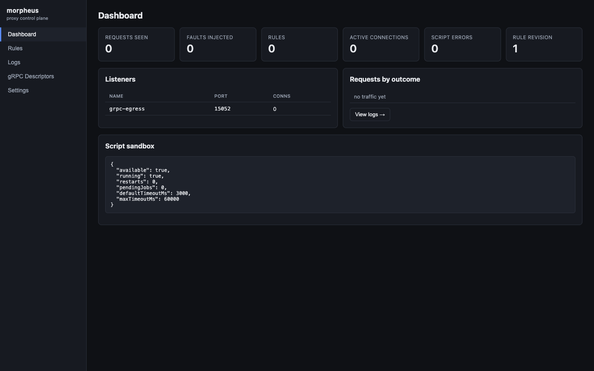
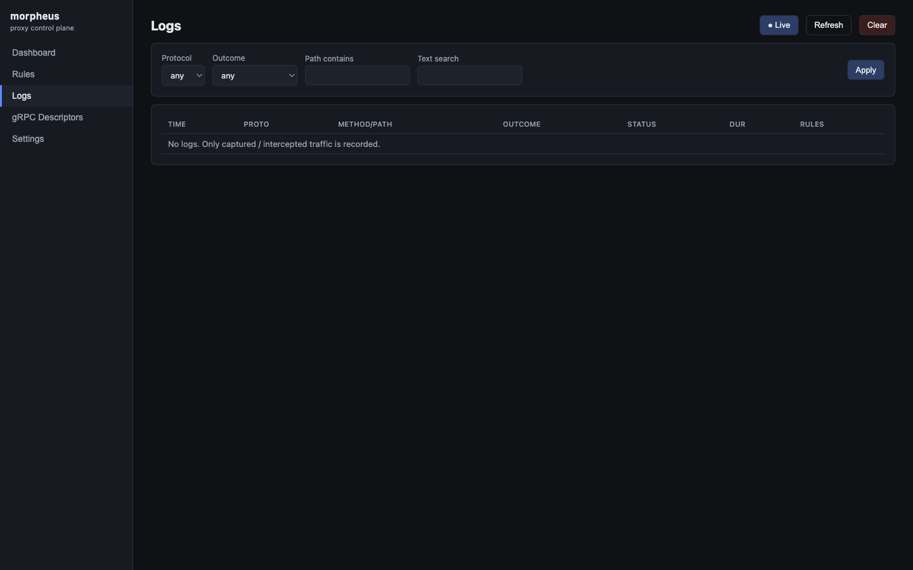
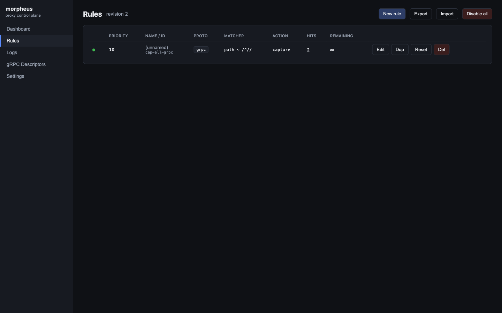
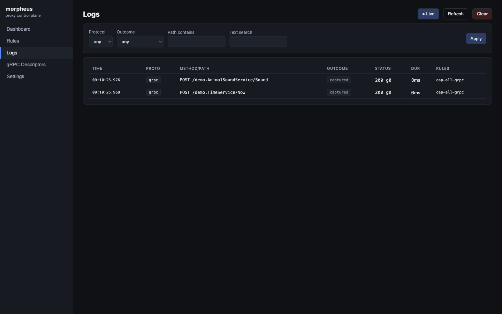
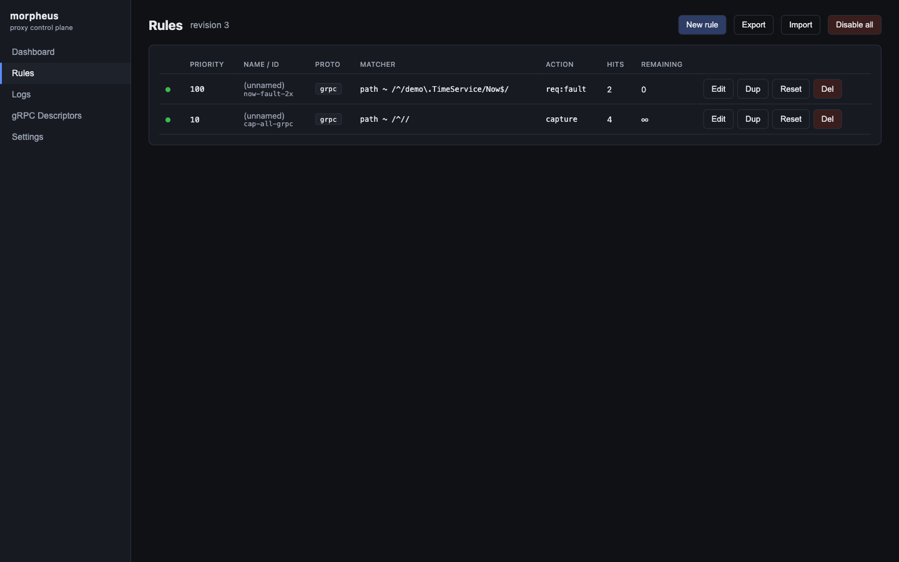
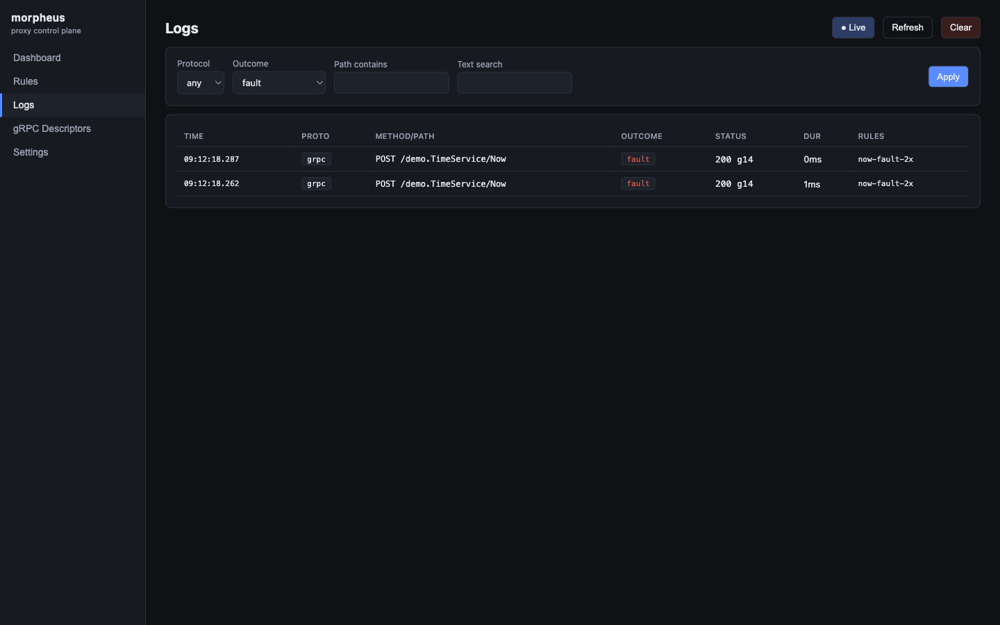
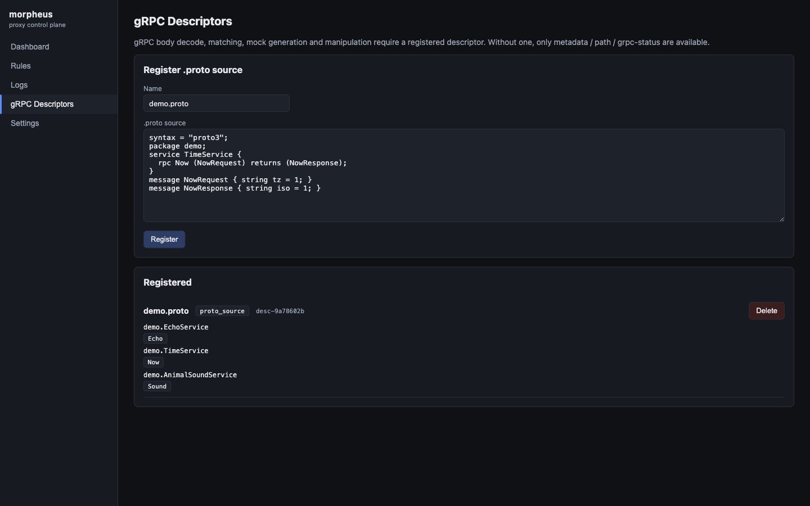
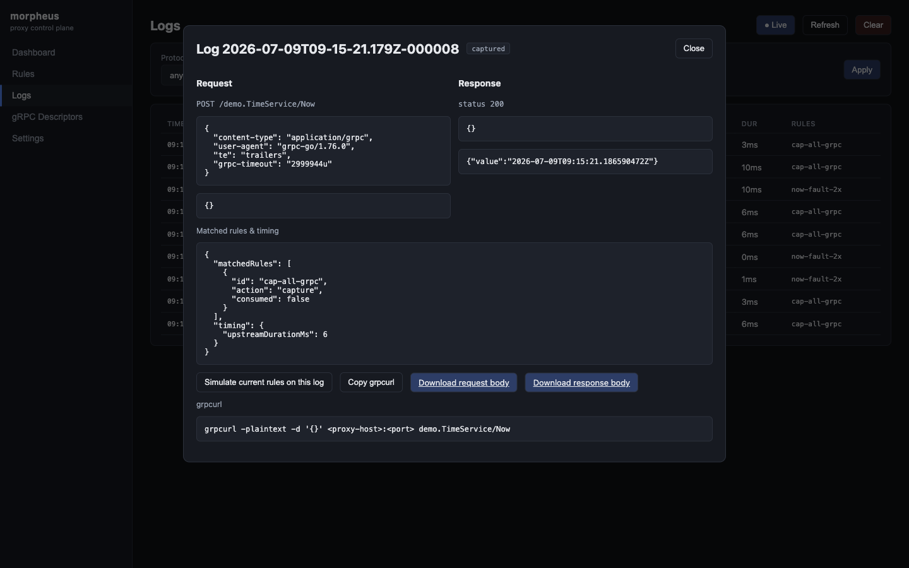
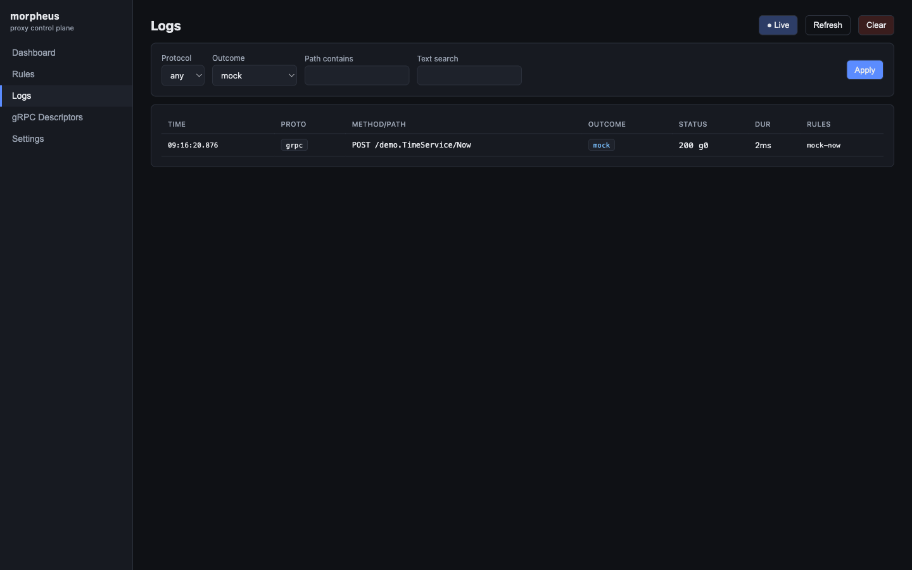
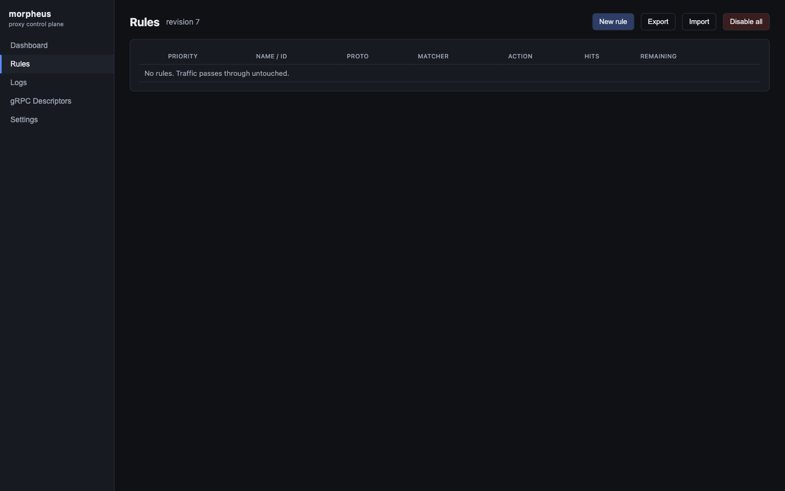

# チュートリアル: Kubernetes(Istio)環境で動作検証する

このチュートリアルは、Istio mesh 上の GKE クラスタに morpheus-proxy を CONNECT egress サイドカーとして導入し、透過転送 → capture → 消費型 fault → descriptor 登録 → decoded body → mock という一連の動作を、admin API と Web UI の両方で確認する手順です。

対象読者は、[how-to-setup.md](how-to-setup.md) の手順で導入済みの dev 環境を持つ人です。まだ導入していない場合は先にそちらを終えてください。

account / project / namespace / context は組織や環境ごとに異なるため、本チュートリアルでは以下のプレースホルダで表記します。実際の値に置き換えて読んでください。

| プレースホルダ | 意味 | 例 |
| --- | --- | --- |
| `<GCLOUD_ACCOUNT>` | GKE にアクセスする gcloud アカウント | `you@example.com` |
| `<KUBE_CONTEXT>` | 対象クラスタの kube context 名 | `gke_<project>_<region>_<cluster>` |
| `<NAMESPACE>` | app をデプロイした namespace | `morpheus-proxy-demo` |
| `<APP_LABEL>` | app の pod を選ぶ label selector | `app=ms-a` |

> スクリーンショットは Web UI の見た目を示す目的で、リポジトリ同梱の [demo/docker-compose.yml](../demo/docker-compose.yml)(ローカルで再現できる同じ CONNECT egress 構成)を使って撮影しています。UI は admin API の見た目そのものなので、GKE 上で操作しても同じ画面になります。

## Step 0. 前提(シェルごとに 1 回)

```sh
# アカウント切替(複数アカウントを使い分けている場合)
gcloud config set account <GCLOUD_ACCOUNT>

# gke-gcloud-auth-plugin を PATH に入れる(Homebrew 版 gcloud は PATH 外に置かれることがある)
export PATH="/opt/homebrew/share/google-cloud-sdk/bin:$PATH"

# 変数
CTX=<KUBE_CONTEXT>
NS=<NAMESPACE>
A=http://localhost:18081/_morpheus/api/v1
```

> **罠**: 直前まで別の gcloud アカウントを使っていた場合、`gcloud config set account` で切り替えても `kubectl` が
> `Error from server (Forbidden): ... cannot list resource "pods" ...` を返すことがあります。原因は
> `gke-gcloud-auth-plugin` が `~/.kube/gke_gcloud_auth_plugin_cache` に**旧アカウントのトークンをキャッシュ**しているためです。
> 次のコマンドでキャッシュを消せば、次の `kubectl` 実行時に現在の active account で再取得されます。
>
> ```sh
> rm -f ~/.kube/gke_gcloud_auth_plugin_cache
> ```

## Step 1. 環境の生存確認

```sh
kubectl --context=$CTX -n $NS get pods
```

- app の pod が `3/3`(app + istio-proxy + morpheus-proxy)なら → Step 3 へ進んでください。
- pod が無い、または `CrashLoopBackOff` などで壊れているなら → Step 2 へ。
- 接続自体に失敗する場合は VPN 接続を確認してください。クラスタごと消えている場合は環境の再構築が必要です(手順は導入時に使ったセットアップ資料を参照)。

## Step 2. (消えていた場合のみ)再デプロイ

CONNECT 方式で導入したマニフェスト一式を再度 apply します(ファイル名は導入時に使ったものに置き換えてください)。

```sh
kubectl --context=$CTX apply -f <namespace-manifest>.yaml
kubectl --context=$CTX apply -f <downstream-manifest>.yaml
kubectl --context=$CTX apply -f <app-with-morpheus-connect-manifest>.yaml
kubectl --context=$CTX -n $NS rollout status deploy/<app> deploy/<downstream>
```

image は push 済みのものを使います。`ImagePullBackOff (403)` が出た場合のみ Artifact Registry の reader 権限付与が必要です(IAM 変更なので実行前に承認を得てください)。

## Step 3. port-forward と初期状態確認

```sh
POD=$(kubectl --context=$CTX -n $NS get pods -l <APP_LABEL> -o jsonpath='{.items[0].metadata.name}')
kubectl --context=$CTX -n $NS port-forward pod/$POD 18081:18081 8080:8080
```

別ターミナルで(Step 0 の変数を再定義してから):

```sh
curl -s http://localhost:18081/_morpheus/healthz/ready          # {"status":"ready"}
curl -s "$A/status" | jq '{listeners, ruleCount, trafficLogCount}'
# listeners に CONNECT egress listener(例: "grpc-egress")が出ていること
open http://localhost:18081/_morpheus/                           # Web UI
```

前回の rule が残っていたら Rules 画面の `Del`、または `Disable all` でクリーンにします(on-memory なので pod 再起動済みなら空のはずです)。

Dashboard を開くと、listener 一覧と rule 数・request 数が確認できます。



## Step 4. 透過確認(rule なし)

app の HTTP エンドポイント(下流を呼び出すもの。例では `/echo`)を叩き、rule が無い状態で正常に応答が返ることを確認します。

```sh
curl -s 'http://localhost:8080/echo?message=hello' | jq .
# → 下流の応答を含む正常な JSON が返る
curl -s "$A/logs?limit=5" | jq .items
# → [] (unmatched passthrough は記録されない)
```

Logs 画面でも空であることが確認できます。**passthrough は記録されない**という morpheus の基本方針がここで確認できます。



## Step 5. capture rule → traffic log

すべての gRPC traffic を capture する observation rule を入れ、再度 app を呼び出します。

```sh
curl -s "$A/rules" -H 'content-type: application/json' -d '{
  "id": "cap-all-grpc", "protocol": "grpc", "priority": 10,
  "match": { "type": "regex", "field": "path", "pattern": "^/" },
  "logging": { "capture": true }
}' | jq '{id: .rule.id, revision}'

curl -s 'http://localhost:8080/echo?message=hello' >/dev/null
curl -s "$A/logs?protocol=grpc&limit=5" | jq -c '.items[] | {path: .request.path, listener, target, outcome}'
```

`listener` が CONNECT egress listener の名前、`target` が下流サービスの接続先(`h2c://<host>:<port>`。環境によっては hostname、環境によっては解決済み IP で記録されます)になっていれば、**app → 下流の通信が CONNECT 経由で morpheus を通っている**ことの実証です。

Rules 画面で rule の hits が増えていること、Logs 画面で下流への呼び出しが記録されていることを確認します。





この時点では descriptor 未登録のため、body は decode されずログの body 欄は空です(unary 判定ができないため)。body は Step 7 で入ります。

## Step 6. 消費型 gRPC fault(descriptor 不要)

特定 method に対して、最初の 2 回だけ `UNAVAILABLE` を返す消費型 rule を入れます。

```sh
curl -s "$A/rules" -H 'content-type: application/json' -d '{
  "id": "now-fault-2x", "protocol": "grpc", "priority": 100,
  "match": { "type": "regex", "field": "path", "pattern": "^/<pkg>\\.<Service>/<Method>$" },
  "request": { "action": { "type": "fault",
    "fault": { "kind": "grpc_status", "status": 14, "message": "injected unavailable" } } },
  "consume": { "times": 2 }
}' | jq '{id: .rule.id}'

for i in 1 2 3; do curl -s -o /dev/null -w "call $i: %{http_code}\n" 'http://localhost:8080/echo?message=x'; done
# → call 1: 502, call 2: 502, call 3: 200(消費しきって透過に復帰)

curl -s "$A/rules/now-fault-2x/state" | jq .   # hits:2, remaining:0
```

`<pkg>.<Service>/<Method>` は対象の gRPC method の full path(例: `demo.TimeService/Now`)に置き換えてください。

Rules 画面で `hits: 2` / `remaining: 0` になっていること、Logs 画面で `outcome: fault` の 2 件が記録されていることを確認します。





再発動したい場合は `curl -s -X POST "$A/rules/now-fault-2x/state:reset"` で counter を初期化できます。確認が終わったら delete しておきます(次の Step で同じ method に別 rule を当てるため、優先度の高いこの rule が残っていると邪魔になります)。

```sh
curl -s -X DELETE "$A/rules/now-fault-2x" | jq .
```

## Step 7. descriptor 登録 → decoded body → mock

### 7-1. `.proto` を登録する

```sh
jq -n --arg name svc.proto --rawfile content <path-to-your.proto> \
  '{name: $name, format: "proto_source", content: $content}' |
curl -s "$A/grpc/descriptors" -H 'content-type: application/json' --data-binary @- \
  | jq '{id, services: [.services[].fullName]}'
```

gRPC Descriptors 画面でも、登録した service / method の一覧が確認できます。



**注意**: `.proto` source の import は well-known types(`google/protobuf/*.proto`)のみ自動解決されます。自作 proto を import している場合は、依存を 1 ファイルに統合するか、API から `format: "descriptor_set"`(`protoc --include_imports` / `buf build` の出力)で登録してください(詳細は [api-manual.md](api-manual.md) §13)。

### 7-2. decoded body を確認する

descriptor 登録後に traffic を流し直すと、decoded JSON body が記録されます(登録前に capture した log には入りません)。

```sh
curl -s 'http://localhost:8080/echo?message=hello' >/dev/null
curl -s "$A/logs?limit=1" | jq '.items[0].response.bodyPreview'
```

Logs detail を開くと、request / response の decoded body(JSON)が読めます。



### 7-3. mock response を試す

descriptor が登録済みなら、message body を含む mock response を登録できます。

```sh
curl -s "$A/rules" -H 'content-type: application/json' -d '{
  "id": "mock-now", "protocol": "grpc", "priority": 100,
  "match": { "type": "regex", "field": "path", "pattern": "^/<pkg>\\.<Service>/<Method>$" },
  "request": { "action": { "type": "mock_response",
    "response": { "grpcStatus": 0, "messages": [ { "<field>": "mock-value" } ] } } }
}' | jq '{id: .rule.id}'

curl -s 'http://localhost:8080/echo?message=hello' | jq .
# → 下流に行かず、morpheus が mock 応答を返している値が見える
```

Logs 画面を `outcome=mock` で絞り込むと、mock が適用された呼び出しが確認できます。



## Step 8. UI で一通り確認する

ブラウザ(`http://localhost:18081/_morpheus/`)で以下を一通り眺めておくと、admin API だけで操作するより状態把握が早くなります。

- **Dashboard**: listener / outcome 別 request 数 / rule 数 / script sandbox 状態
- **Rules**: hits / remaining、Edit で JSON を直接編集、Validate / Simulate
- **Logs**: filter、detail モーダルの decoded body、`Simulate current rules on this log`、`Copy curl` / `Copy grpcurl`
- **gRPC Descriptors**: 登録済み service / method 一覧
- **Settings**: mask 設定、log retention 表示

UI でできることはすべて admin API でもできます。細部は [admin-console-manual.md](admin-console-manual.md) を参照してください。

## Step 9. 後片付け

```sh
for id in cap-all-grpc mock-now; do
  curl -s -X DELETE "$A/rules/$id" | jq -c .
done
curl -s -X DELETE "$A/logs" | jq .
# port-forward のターミナルを Ctrl-C
```

Rules 画面が空になっていれば、環境をクリーンな状態に戻せています。



```sh
# 複数アカウントを使い分けている場合は元に戻す
gcloud config set account <GCLOUD_ACCOUNT_ORIGINAL>
```

## 補足

- rule / descriptor は on-memory です。pod 再起動で消えるため、再検証時は Step 5 からやり直してください。
- Pod 内から API を直接叩く場合、busybox `wget` は DELETE に対応していません。削除系は port-forward した手元の `curl`、またはコンテナ内の Node.js fetch を使ってください(詳細は [how-to-setup.md](how-to-setup.md) §8 / [api-manual.md](api-manual.md) §16)。
- 個々のコマンドの詳細(matcher の種類、fault kind、script rule など)は [api-manual.md](api-manual.md) を、Web UI の全操作は [admin-console-manual.md](admin-console-manual.md) を参照してください。
